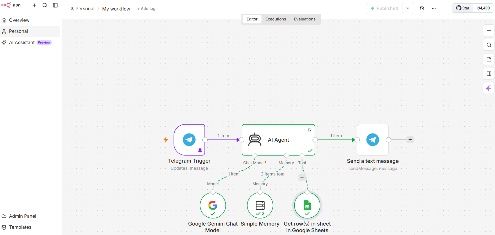

# AI-Automated-Search-Agent

This project demonstrates the architecture of integrating automated workflows with Google search systems using the **Custom Search API**.

## Project Goal
The primary objective was to build an intelligent agent capable of performing targeted web searches to retrieve structured data in real-time. This data serves as a foundation for further processing and analysis by LLM models.

## Development & Implementation
1. **Infrastructure Setup:** Configured a project within the Google Cloud Platform and enabled the **Custom Search API** to allow programmatic access to search results.
2. **Search Engine Design:** Created a `Programmable Search Engine` (MySearchBot) tailored to provide clean, structured JSON responses for automated parsing.
3. **API Integration:** Implemented HTTP request nodes in **n8n**, managing authentication via `key` and `cx` (Search Engine ID) parameters to ensure secure and efficient data retrieval.
4. **Troubleshooting & Technical Analysis:** 
   - Addressed the `403 Forbidden` (Permission Denied) error through systematic API console debugging.
   - Identified and resolved limitations related to the project's verification status, specifically the requirement for linking a billing account to GCP for full API functionality.
   - Optimized **API restrictions** to maintain security and ensure requests are limited to the intended scope.

## Technical Stack
- **n8n:** Automation Workflow Platform
- **Google Cloud Platform:** API and Service Management
- **Google Custom Search API:** Data Retrieval
- **Markdown/JSON:** Data Formatting and Configuration
## Workflow Visualization

